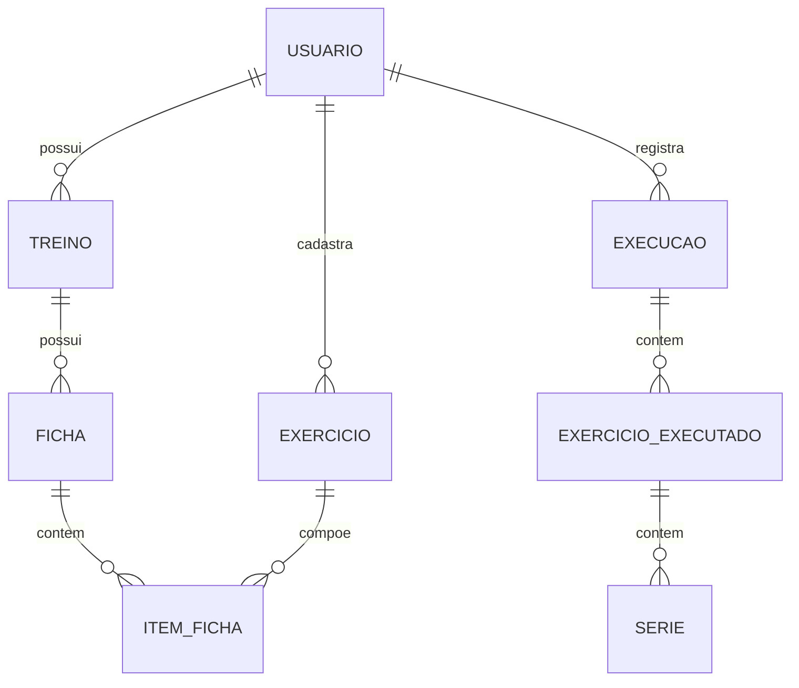

# Arquitetura de usuários e treinos

## Dados

- Usuário: nome, e-mail único, perfil (`common` ou `administrator`), fuso horário e senha protegida pelo Identity.
- Treino: nome, descrição e fichas. A tabela existente `workout_plans` representa o treino cadastrado.
- Ficha: nome, código, ordem, orientações e exercícios. A tabela `workout_templates` representa a ficha.
- Exercício: nome até 160 caracteres, equipamento até 16.000 caracteres e instruções até 200.000 caracteres. O banco usa TEXT para equipamento e LONGTEXT para instruções. Equipamento e instruções podem ficar vazios.
- Item da ficha: exercício, ordem, séries, repetição/duração, descanso e alternativas. Todos os exercícios referenciados devem pertencer ao mesmo usuário da ficha e do treino.
- Execução: registro datado com snapshots da ficha/exercícios e resultados. Alterar o catálogo não reescreve o histórico.

Os nomes internos `plans` e `templates` e as rotas antigas continuam compatíveis com o PWA, recibos e SQL já existentes. A interface usa Treinos e Fichas. Não há limite de um treino por usuário ou de uma ficha por treino.

## Autorização

A identidade autenticada (`ICurrentUser`) é o autor da requisição. `ITrainingOwner` identifica o proprietário dos dados, após validação do middleware. Usuários comuns só podem selecionar a própria conta; administradores podem selecionar uma conta ativa diferente. Todas as consultas, gravações, validações de referências, locks, revisões e recibos de treino usam esse proprietário.

O cadastro de usuários sempre verifica o autor autenticado, independentemente do proprietário selecionado. Contas comuns podem consultar e editar o próprio cadastro sem alterar seu perfil. Somente administradores listam, criam e excluem contas ou alteram perfis. A exclusão lógica revoga o acesso, preserva referências e expira mensagens de recuperação pendentes. A proteção do último administrador usa um lock no banco para serializar exclusões e rebaixamentos.

## API

| Entidade | Rotas |
|---|---|
| Usuários | GET/POST `/api/users`; GET/PUT/DELETE `/api/users/{id}` |
| Treinos do usuário | GET/POST `/api/users/{userId}/trainings`; GET/PUT/DELETE `/api/users/{userId}/trainings/{id}` |
| Treinos | GET/POST `/api/trainings`; GET/PUT/DELETE `/api/trainings/{id}` |
| Fichas do treino | GET/POST `/api/trainings/{id}/sheets` |
| Ficha | GET/PUT/DELETE `/api/sheets/{id}`; PUT exige `?planId={idDoTreino}` |
| Exercícios | GET/POST `/api/exercises`; GET/PUT/DELETE `/api/exercises/{id}` |
| Execuções, exercícios executados e séries | `/api/sessions` e suas rotas aninhadas |
| Relatórios e sincronização | `/api/reports`, `/api/sync` |

Para selecionar o proprietário em rotas sem `{userId}`, envie `X-Training-User: UUID`. Sem esse cabeçalho, o proprietário é o usuário autenticado. A rota explícita do usuário tem precedência sobre o cabeçalho. Contas comuns recebem 403 ao tentar selecionar outra conta. Uma conta inexistente ou excluída retorna 404 ao administrador.

Criação de usuário: `{ "name": "Maria", "email": "maria@example.com", "role": "common", "timeZone": "America/Sao_Paulo", "initialPassword": "senha com 12 a 128 caracteres" }`. A edição utiliza os mesmos campos de cadastro, sem senha inicial, e exige `expectedVersion`. DELETE exige `?expectedVersion=...`. Não é possível rebaixar ou excluir o último administrador.

Criação de exercício: `{ "name": "Agachamento", "equipment": "Barra", "instructions": "Orientações completas" }`. A edição também exige `expectedVersion`. Metadados anteriores de duração e carga são preservados quando omitidos; novos cadastros recebem os padrões compatíveis com registros de repetições.

Todas as mutações exigem autenticação, troca da senha inicial quando pendente e CSRF. Os comandos de execução conservam versões e recibos idempotentes descritos no README.

## Containers e atualização

Frontend, backend, MariaDB e migrator continuam no pod definido pelo Compose da raiz. A execução padrão é HTTP; a configuração opcional de Let’s Encrypt permanece disponível. O migrator aplica 001, 003 e 004 antes da API. Não altere os scripts originais já registrados no journal.

Para atualizar uma instalação existente, faça backup e use `podman compose up -d --build --force-recreate`. Os volumes persistentes preservam contas, treinos, histórico e chaves. Não use `down -v` durante a atualização. Reabra/atualize o PWA para carregar a nova interface.
